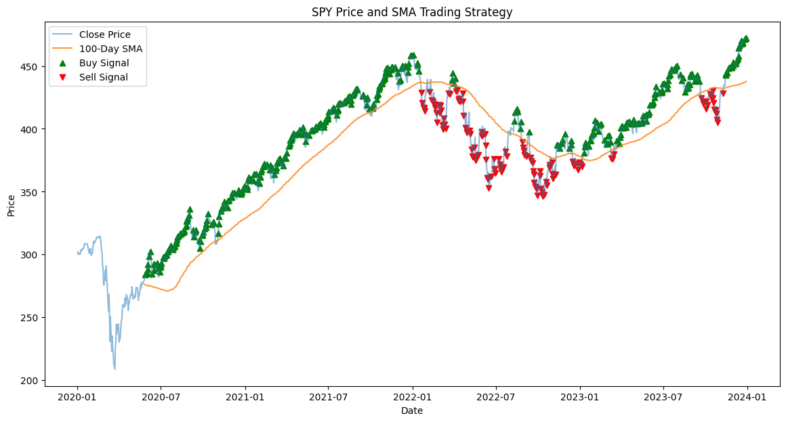
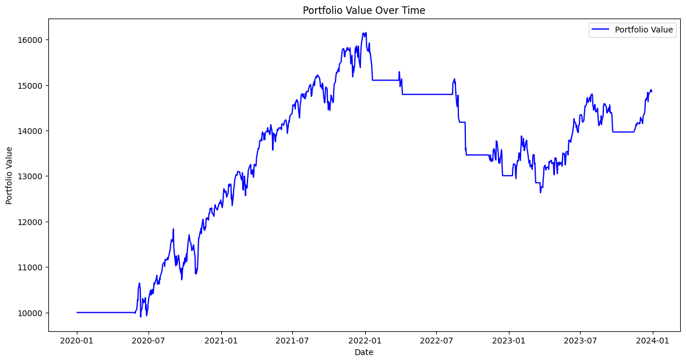
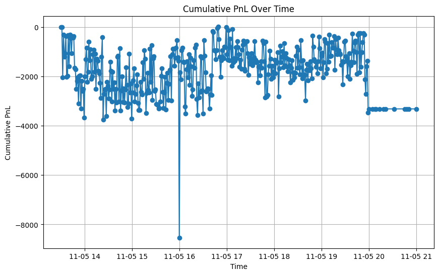
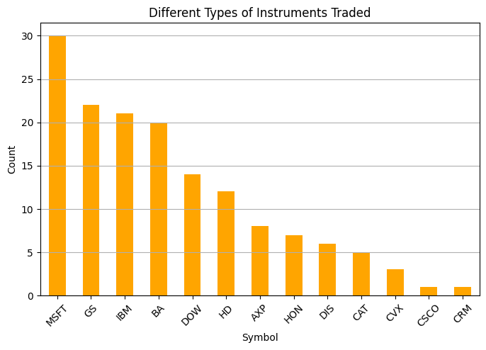
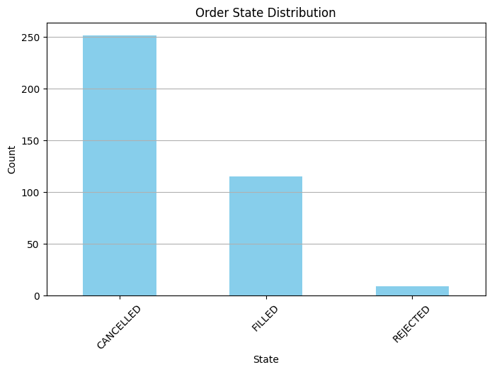
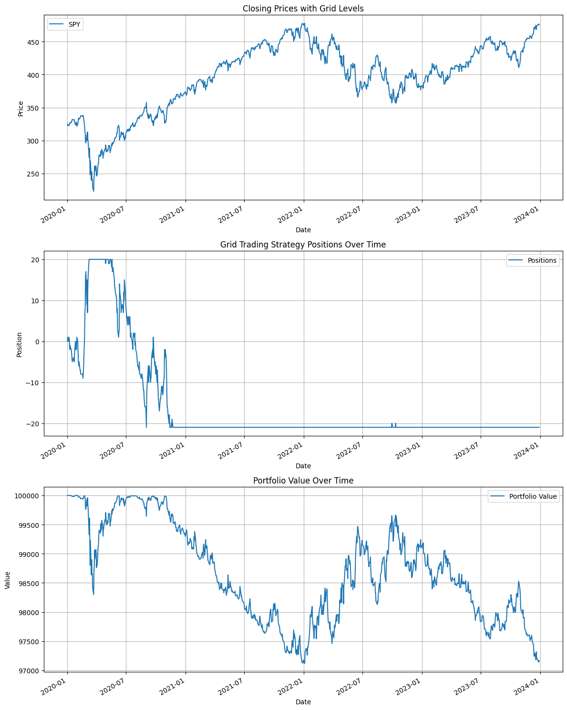

# Final Report
### Team Members and Their Contributions

- **[Khushi Kalra]**:
  - Implementation of Maker Strategy in Python using ipynb
  - Implementation of Maker Strategy in Cpp 
  - Final Project Report

- **[Siddarth Ananath]**:
  - Initial Setup
  - Toy Strategy
  - Developed scripts for: result_visualization (SS output), bash scripts for automating backtests (run_strategy.sh) to simplify tasks across repo
  - Implementation and backtesting of Taker Strategy in Python using ipynb
  - Implementation and backtesting of Taker Strategy in Cpp using Strategy Studio
  - Github ReadMe's
  - Taker Demo Video

- **[Asuthosh Anandaram ]**:
  -
  - Implementation and backtesting of Taker Strategy in Python using ipynb
  - Implementation and backtesting of Taker Strategy in Cpp for Strategy Studio
  - Final Report
  - Github ReadMe
  - Documeting taker and maker strategies

- **[Krish Nangia]**:
  - Maker Strategy Ideation
  - Implementation and succesful backtesting of Maker Strategy in Python using ipynb
  - Implementation and (attempted) backtesting of Maker Strategy in Cpp using Strategy Studio
  - Maker Demo Video

# SMA (Simple Moving Averages) Based Reactive Taker Strategy

## Abstract
This report outlines the **SMA (Simple Moving Average)-based Reactive Taker Strategy**, a quantitative trading algorithm designed to trade SPY (S&P 500 ETF) using the 100-day Simple Moving Average (SMA) as a dynamic support and resistance indicator. The strategy leverages moving averages to identify potential buy and sell signals, focusing on price interactions with the 100-day SMA. The core principle of this strategy is that market behavior, especially in medium-term trends, can be predicted using historical price averages. This report provides an in-depth look into the strategy, including its conceptual framework, implementation details, results, and areas for future development.

## Introduction
Algorithmic trading, or automated trading, has revolutionized financial markets by using mathematical models to make data-driven decisions at speeds and frequencies that are impossible for human traders. Among the many indicators used in algorithmic trading, **moving averages** are one of the simplest yet most powerful tools. The **Simple Moving Average (SMA)** smooths price data over a specific period and helps traders identify the direction of the trend, as well as potential reversals.

This report focuses on a strategy using the **100-day Simple Moving Average (SMA)** as a core indicator. The 100-day period is selected for its ability to capture medium-term market trends without being overly reactive to short-term price fluctuations. The strategy identifies trading signals based on price interactions with the SMA, and it aims to profit from sustained trends while minimizing exposure to short-term market noise.

The report discusses the logic behind the SMA-based strategy, details the current implementation and testing process, and outlines the next steps required to improve the strategy’s performance and risk management.

## Strategy Overview

### Moving Average Calculation
At the heart of this trading strategy lies the **100-day Simple Moving Average (SMA)**, which is calculated as the average of the closing prices of SPY over the past 100 trading days. The **SMA** serves as an indication of the market’s medium-term trend:

- **Bullish Trend**: When the current price is above the 100-day SMA, it suggests a bullish or upward trend, indicating that the market is in an uptrend.
- **Bearish Trend**: When the current price is below the 100-day SMA, it suggests a bearish or downward trend, indicating that the market is in a downtrend.

The primary assumption in this strategy is that the price is likely to continue following the trend established by the SMA until significant external factors intervene.

### Dynamic Support and Resistance
The 100-day SMA not only helps determine the trend direction but also acts as a dynamic level of **support** or **resistance**:
- **Support**: If the price is above the 100-day SMA, the SMA serves as a potential support level. A pullback toward this level could indicate a buying opportunity, as the price is expected to bounce back upwards.
- **Resistance**: If the price is below the 100-day SMA, the SMA serves as a resistance level. A rally toward this level may signal a sell opportunity, as the price could reverse downward once it hits resistance.

These dynamics of support and resistance are integral to identifying entry and exit points in the market, with price action around the SMA providing valuable information about potential trends.

## Signal Logic

### Buy Signal
A **Buy Signal** is generated when:
1. The price has been above the 100-day SMA for two consecutive trading days. This indicates that the market is in an uptrend.
2. The price has been increasing each day for two consecutive days. This is confirmed by checking the condition `price[i] > price[i-1]` for two consecutive days. This confirms the continuation of the upward trend and suggests that momentum is building.

In other words, the price must not only be above the SMA but also show a positive momentum over the last two trading days, ensuring that the trend is strong enough to warrant a buying decision.

### Sell Signal
A **Sell Signal** is generated when:
1. The price has been below the 100-day SMA for two consecutive trading days. This signals that the market is in a downtrend.
2. The price has been decreasing each day for two consecutive days. This is confirmed by checking the condition `price[i] < price[i-1]` for two consecutive days, which indicates that momentum is driving the price downward.

Similar to the buy signal, the sell signal is based on both the price being below the SMA (indicating a downtrend) and the momentum being negative for the last two days.

### Momentum Consideration
The strategy incorporates **momentum** as a key factor in confirming the strength of the trend. By ensuring that the price moves consistently in one direction over two consecutive days, the strategy minimizes the risk of reacting to market noise or short-term fluctuations. This method helps improve the robustness of the signals and reduces the likelihood of false positives.

## Current Implementation

#### **1. Introduction**
- The **SMA-Based Reactive Taker Strategy** is a trading algorithm designed to capitalize on price interactions with the Simple Moving Average (SMA) as a dynamic support and resistance indicator.
- Development progressed in two stages:
  1. **Prototype Implementation in Python**: For proof of concept using historical SPY data.
  2. **Advanced Implementation in C++**: For integration with **Strategy Studio**, enabling real-time market data analysis and live trading.
- The goal is to refine and deploy a systematic trading approach that is both profitable and resilient to market volatility.

---

#### **2. Initial Python Implementation**
##### **2.1 Methodology**
- **Data Source**:
  - Historical SPY data (January 1, 2020 – December 31, 2023) fetched using the `yfinance` library.
- **Indicators**:
  - **100-Day SMA**: Used as a benchmark for buy and sell signals.
  - **Momentum**: Incorporated to confirm the trend and filter out noise.
- **Signal Generation**:
  - **Buy Signal**: When the current price > previous price > SMA.
  - **Sell Signal**: When the current price < previous price < SMA.

##### **2.2 Backtesting Framework**
- **Capital Allocation**:
  - Entire portfolio invested when a buy signal was triggered.
  - Full liquidation when a sell signal occurred.
- **Portfolio Value Calculation**:
  - Tracked daily, accounting for the execution of trades.

##### **2.3 Results and Insights**

- **Initial Capital**: $10,000.
- **Final Portfolio Value**: $14,854.48.
- **Return**: 48.5% over three years.
- **Observations**:
  - Profitable during the testing period, effectively capturing medium-term trends.
  - Lacked diversification and advanced risk management mechanisms, leading to potential overexposure in volatile markets.

---

#### **3. Advanced Implementation in C++ with Strategy Studio**
##### **3.1 Objectives**
- Transition the Python implementation into **C++** to leverage **Strategy Studio**’s capabilities:
  - Real-time integration with market data (IEX).
  - Advanced execution logic and risk management.
  - Scalability for live deployment.

##### **3.2 Key Features**
1. **Momentum Indicators**:
   - Utilized rolling windows for:
     - **Short SMA (9-day)**: Capturing short-term trends.
     - **Long SMA (30-day)**: Capturing medium-term trends.
2. **Signal Logic**:
   - Similar to the Python version but with additional validation for momentum.
3. **Dynamic Position Sizing**:
   - Introduced the `position_size` parameter to adjust trade sizes dynamically based on market conditions.
4. **Risk Management**:
   - Implemented order repricing to minimize slippage and improve execution efficiency.
5. **Execution Logic**:
   - Orders placed at optimal bid/ask prices with continuous monitoring for market changes.

#### **2.3 Backtesting Results**

##### **Backtest Result Visualization**

The following visualizations summarize the backtesting results from the **Strategy Studio** implementation:

1. **Cumulative PnL Over Time**:
   - Demonstrates the overall profitability and growth of the strategy during the testing period.
   - Visualized as a line plot with markers for clarity.

   

2. **Types of Instruments Traded**:
   - A bar chart depicting the distribution of different instruments (symbols) traded.
   - Helps assess diversification and trading focus.

   

3. **Order State Distribution**:
   - A bar chart showing the frequency of different order states (e.g., filled, canceled).
   - Provides insights into execution efficiency and strategy behavior.

   

#### **4. Conclusion**
- The **SMA-Based Reactive Taker Strategy** has demonstrated significant potential:
  - **Python Prototype**: Validated the concept with a profitable backtest.
  - **C++ Implementation**: Enhanced scalability, execution, and risk management for real-world deployment.
- Future work will focus on optimizing performance metrics, refining risk management, and adapting the strategy to a broader range of market conditions.

**Appendix**: 
Future developments will explore ways to enhance the momentum filtering process and consider integrating additional technical indicators to further validate the trade signals. Moreover, the potential for using machine learning techniques to predict market trends will be investigated to improve the strategy's predictive accuracy.

---

# Grid Trading Strategy

**Final Report: Grid Trading Strategy (Market Maker Strategy)**

### **Introduction**

The **Grid Trading Strategy**, often termed the Market Maker Strategy, is a quantitative algorithmic trading method designed to capitalize on price oscillations within predefined intervals, referred to as "grid levels." By systematically placing buy and sell orders across these levels, the strategy aims to profit from market volatility while maintaining a neutral portfolio over time. Unlike directional strategies, grid trading thrives in range-bound markets, making it particularly effective during periods of low overall trend strength.

This report delves into the theoretical underpinnings, practical implementation, and backtesting results of the Grid Trading Strategy. It covers the initial prototype development in Python and its subsequent implementation in C++ using Strategy Studio for scalability and real-time trading.

---

### **Conceptual Framework**

#### **Grid Levels**
At the core of the Grid Trading Strategy lies the segmentation of the price range into discrete grid levels. 

#### **Trade Execution**
The strategy revolves around a simple yet effective rule set:
- **Buy Orders**: Executed when the price crosses downward into a lower grid level.
- **Sell Orders**: Executed when the price crosses upward into a higher grid level.

This mechanism ensures that the portfolio continuously rebalances to exploit price oscillations. For instance:
- If SPY's price drops from $102 to $100, the strategy buys at $101.
- Conversely, if SPY's price rises from $99 to $101, the strategy sells at $100.

#### **Neutral Portfolio Philosophy**
The strategy inherently avoids directional market bias by balancing positions at different price levels. As prices oscillate, the portfolio alternates between long and short positions, stabilizing overall exposure.

### **Implementation Details**

#### **Python Prototype**

##### **Methodology**
1. **Data Source**:
   Historical SPY data (2020-2023) was sourced using the `yfinance` library, offering comprehensive coverage for backtesting.

2. **Grid Initialization**:
   Grid levels were dynamically calculated based on the midpoint of the initial price and specified parameters:
   - **Initial Capital**: $100,000.
   - **Grid Size**: 0.5%.
   - **Number of Grids**: 20 levels above and below the midpoint.

3. **Execution Logic**:
   - At each grid level, the strategy either buys (on downward price movement) or sells (on upward price movement).
   - Transaction costs of 0.01% per trade were included to simulate real-world conditions.

4. **Performance Metrics**:
   - **Total Return**: Net gain or loss over the backtesting period.
   - **Sharpe Ratio**: Risk-adjusted return.
   - **Maximum Drawdown**: Largest peak-to-trough decline in portfolio value.

#### **C++ Implementation with Strategy Studio**

##### **Objectives**
The C++ implementation sought to:
- Scale the strategy for real-time trading.
- Automate execution using Strategy Studio's advanced features.
- Integrate live market data to dynamically adjust grid levels.

##### **Key Features**
1. **Dynamic Grid Levels**:
   - Grid levels recalculated at runtime to adapt to price changes.

2. **Order Management**:
   - Implemented robust logic for placing and managing buy/sell orders through Strategy Studio's APIs.

3. **Real-Time Position Tracking**:
   - Monitored cash reserves, open positions, and portfolio value in real time.

4. **Risk Mitigation**:
   - Incorporated order cancellation and repricing mechanisms to minimize slippage.

### **Backtesting Results**

1. **Closing Prices with Grid Levels**:
   - Demonstrated the alignment between price movements and triggered trades.
2. **Positions Over Time**:
   - Showed how positions dynamically adjusted to market fluctuations.
3. **Portfolio Value**:
   - Revealed the strategy's susceptibility to losses in trending markets.

- **Initial Capital**: $100,000.
- **Final Portfolio Value**: $97,170.
- **Total Return**: \(-2.83\%\).
- **Sharpe Ratio**: \(-0.45\).
- **Maximum Drawdown**: \(-2.88\%\).

##### **Visualization**
1. **Closing Prices with Grid Levels**:
   - Visualized SPY's closing prices overlaid with the dynamic grid levels to demonstrate entry and exit points.
2. **Positions Over Time**:
   - Highlighted fluctuations in portfolio positions corresponding to price movements.
3. **Portfolio Value**:
   - Tracked cumulative portfolio performance throughout the backtesting period.

   

